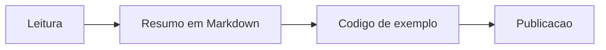

+++
title = "Markdown Lab 02: Mermaid, Math e Colapso"
date = "2026-03-05"
description = "Teste de diagramas, formulas e shortcode de conteudo recolhivel."
tags = ["markdown", "mermaid", "math"]
categories = ["Geral"]
author = "Thiago B."
mermaid = true
math = true
+++

Este segundo laboratorio valida recursos de documentacao tecnica para posts mais densos.

## Fluxo de estudo



## Formula curta

A complexidade de busca binaria eh $O(\log n)$, enquanto uma busca linear eh $O(n)$.

## Formula em destaque

$$
T(n) = 2T\left(\frac{n}{2}\right) + O(n)
$$

## Conteudo recolhivel





## JSON formatado

```json
{
  "project": "String[] args",
  "stack": ["Hugo", "Tailwind", "Markdown"],
  "status": "ok"
}
```
